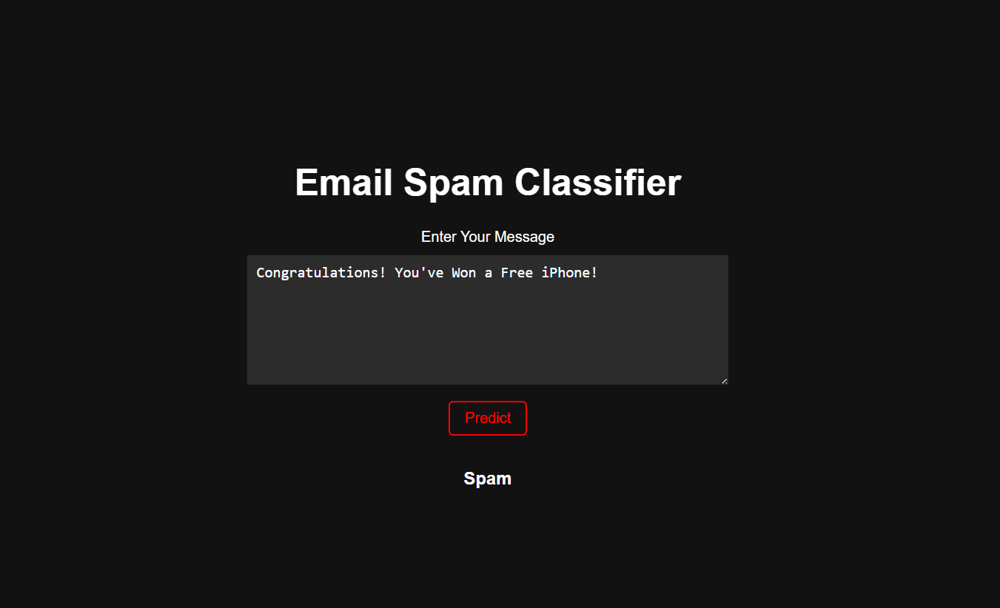

📧 Email Spam Classification App

A full-stack Email Spam Classifier built with:

- ⚙️ FastAPI for the backend API
- 📊 Logistic Regression for email classification
- ⚛️ React for the frontend user interface

The app allows users to input email text and instantly see whether it’s classified as Spam or Not Spam.




---

🚀 Features

✅ Clean and preprocess email text  
✅ Vectorize using TF-IDF  
✅ Train Logistic Regression classifier  
✅ REST API with FastAPI for predictions  
✅ Modern React frontend for user input and results display  
✅ Easy to run locally or deploy

---

```markdown
📁 email-spam-classifier/
├── backend/
│   ├── app.py              # FastAPI app
│   └── spam.csv            # Training data
├── requirements.txt        # Backend dependencies
├── frontend/
│   ├── public/
│   ├── src/
│   │   ├── App.js          # React main app
│   │   └── components/     # UI components
│   └── package.json        # Frontend dependencies
├── README.md               # Project documentation
└── Notebook.ipynb          # Py notebook
```


⚙️ Installation & Setup

1️⃣ Clone the Repository

git clone https://github.com/<your-username>/email-spam-classifier.git
cd email-spam-classifier

---

2️⃣ Setup Backend (FastAPI)

cd backend
python -m venv venv
source venv/bin/activate  # Windows: venv\Scripts\activate
pip install -r requirements.txt

# Train and save the model
python train.py

# Start FastAPI server
uvicorn app:app --reload

The API will be available at http://127.0.0.1:8000.  
✅ Or use the deployed API: [Deployed API](https://backend-email-spam.onrender.com/)

---

3️⃣ Setup Frontend (React)

Open a new terminal window/tab:

cd frontend
npm install
npm start

The React app will run on http://localhost:3000.  
✅ Or use the deployed app: [Live Frontend](https://email-span-detection-204z6vabr-aditya04012s-projects.vercel.app/)

---

📈 Model Training

To train or retrain the model, edit backend/train.py as needed and run:

python train.py

The trained model will be saved as model.pkl.

---

📡 How it Works

- User enters email text in the React frontend.
- React sends the text to FastAPI using a POST request.
- FastAPI preprocesses the text, vectorizes it, loads the Logistic Regression model, and predicts spam or not.
- Result is sent back to the frontend and displayed instantly.

---

✅ Requirements

Backend

- Python 3.8+
- FastAPI
- scikit-learn
- nltk
- uvicorn

Frontend

- Node.js
- npm
- React

All dependencies are listed in backend/requirements.txt and frontend/package.json.

---


🤝 Contributing

Feel free to fork, improve, and open a PR.  
Suggestions are welcome!

🙌 Acknowledgements

- FastAPI
- React
- scikit-learn
